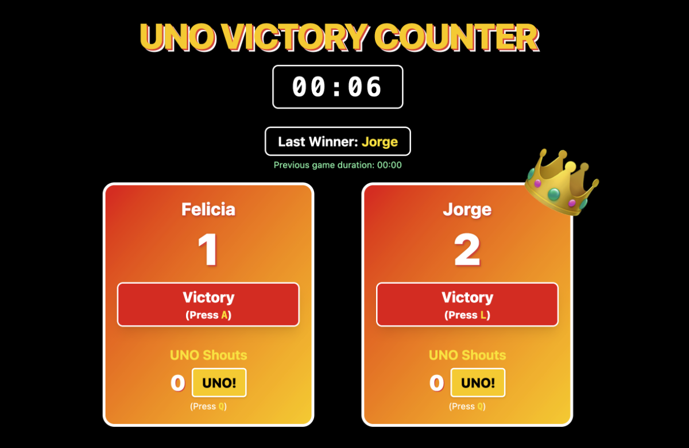

# UNO Victory Counter

   


A modern, feature-rich Svelte app for tracking UNO game victories, UNO shouts, and game statistics. Designed for local multiplayer UNO sessions, this app provides a beautiful, interactive, and persistent scoreboard with advanced analytics.

## Features

- **Victory Counter**: Track victories for two players (default: Felicia and Jorge).
- **Editable Player Names**: Click on a player's name to edit it. Names are saved in your browser.
- **UNO Shout Counter**: Each player has a UNO shout button. Track how many times each player shouts "UNO!" per game.
- **Game Timer**: A large, central timer shows the current game's duration. Click the timer to pause/resume.
- **Automatic Game Logging**: When a player wins, the game is logged (winner, duration, UNO shouts, timestamp) and the timer and UNO shouts reset for the next game.
- **Persistent Storage**: All scores, names, and game history are saved in your browser's localStorage. You can close and reopen the app without losing data.
- **Statistics Dashboard**:
  - Average game duration
  - Current and longest winner streaks
  - Average UNO shouts per game
  - Chart of last 10 games (duration and UNO shouts)
  - Per-game UNO shouts history
- **Keyboard Shortcuts**:
  - `A`: Add victory for Player 1
  - `L`: Add victory for Player 2
  - `Q`: Add UNO shout for Player 1
  - `P`: Add UNO shout for Player 2
- **UNO Themed UI**: Stylish, responsive design with UNO-inspired colors (red, yellow, black, white) and crown icons for the current leader.
- **Accessibility**: All interactive elements are keyboard accessible. Editing names does not trigger game actions.

## How It Works

1. **Start a Game**: The timer starts automatically. Each player can shout UNO or win the game using the buttons or keyboard shortcuts.
2. **Shouting UNO**: Click the "UNO!" button or use the shortcut to increment your UNO shout count for the current game.
3. **Winning a Game**: Click the "Victory" button or use the shortcut. The app logs the game (winner, duration, UNO shouts), resets the timer and UNO shouts, and updates all statistics.
4. **Editing Names**: Click a player's name to edit. Press Enter or click away to save. Names are stored in localStorage.
5. **Viewing Stats**: The statistics section shows averages, streaks, and a chart of the last 10 games. Hover over the chart for details.
6. **Pausing the Timer**: Click the timer to pause or resume. The timer is paused automatically when editing names.

## Data Persistence

- All data (scores, names, game history) is stored in your browser's localStorage. Clearing browser data will reset the app.

## Development

### Prerequisites

- Node.js (v16+ recommended)
- pnpm (or npm/yarn)

### Install & Run

```bash
pnpm install
pnpm dev
```

Open [http://localhost:5173](http://localhost:5173) in your browser.

### Build for Production

```bash
pnpm build
```

### Tech Stack

- [Svelte](https://svelte.dev/)
- [Vite](https://vitejs.dev/)
- [Tailwind CSS](https://tailwindcss.com/)
- [Chart.js](https://www.chartjs.org/)

## File Structure

- `src/routes/+page.svelte` — Main app logic and state
- `src/routes/components/PlayerCard.svelte` — Player card UI (victory, UNO, name editing, crown)
- `src/routes/components/LastWinner.svelte` — Last winner and previous game duration
- `src/routes/components/StatisticsSection.svelte` — Statistics and chart
- `src/app.css` — Global styles

## Customization

- You can change the default player names in the code or via the UI.
- To reset all data, clear your browser's localStorage for this site.

## License

MIT

# Svelte library

Everything you need to build a Svelte library, powered by [`sv`](https://npmjs.com/package/sv).

Read more about creating a library [in the docs](https://svelte.dev/docs/kit/packaging).

## Creating a project

If you're seeing this, you've probably already done this step. Congrats!

```sh
# create a new project in the current directory
npx sv create

# create a new project in my-app
npx sv create my-app
```

## Developing

Once you've created a project and installed dependencies with `npm install` (or `pnpm install` or `yarn`), start a development server:

```sh
npm run dev

# or start the server and open the app in a new browser tab
npm run dev -- --open
```

Everything inside `src/lib` is part of your library, everything inside `src/routes` can be used as a showcase or preview app.

## Building

To build your library:

```sh
npm run package
```

To create a production version of your showcase app:

```sh
npm run build
```

You can preview the production build with `npm run preview`.

> To deploy your app, you may need to install an [adapter](https://svelte.dev/docs/kit/adapters) for your target environment.

## Publishing

Go into the `package.json` and give your package the desired name through the `"name"` option. Also consider adding a `"license"` field and point it to a `LICENSE` file which you can create from a template (one popular option is the [MIT license](https://opensource.org/license/mit/)).

To publish your library to [npm](https://www.npmjs.com):

```sh
npm publish
```
